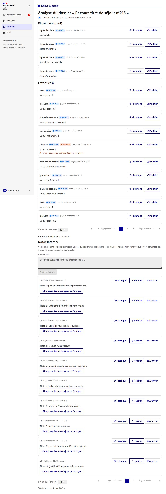
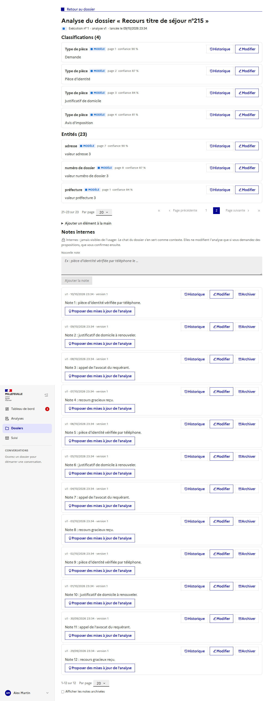

# Analyse de dossier : la vue de l'instructeur

Issue : [#116](https://github.com/IA-Generative/mille-feuille/issues/116) (parent [#106](https://github.com/IA-Generative/mille-feuille/issues/106)).

L'analyse de dossier est le document de travail d'un dossier : **une analyse par exécution**, faite d'éléments (classifications, entités, relations, synthèses, champs) qui ont chacun plusieurs versions. Cette page permet à l'instructeur de la **consulter**, de voir d'où vient chaque valeur, de **l'enrichir**, de **revenir à une version antérieure** et de traiter les **propositions de modification**. Elle est interne : elle n'est jamais montrée aux usagers.

## Y accéder

Dans l'en-tête d'un dossier, l'icône « liste » (à gauche de l'icône assistant) ouvre `/dossiers/<id>/analyse`.

## La vue

- **Exécution :** le sélecteur en haut à droite permet de consulter les exécutions précédentes. Seule l'analyse la plus récente est modifiable ; les autres sont en lecture seule, et une analyse **figée** ne se modifie plus.
- **Éléments** groupés par type. Chaque élément indique sa **provenance** : *Modèle*, *Instructeur* (avec l'auteur) ou *Reprise*, la page, la confiance du modèle, et la **valeur du modèle** quand un instructeur l'a remplacée (elle n'est jamais écrasée).
- **« À revoir »** : signale un élément validé dont les entrées ont changé (relance de l'analyse), avec le motif.
- **Modifier** apporte une nouvelle valeur ; le **motif est obligatoire**. Les relations ne s'éditent pas en texte (restauration seulement).
- **Ajouter un élément à la main** en bas de page.

## Propositions en attente

Une proposition (par exemple issue du chat ou d'une note) n'applique **rien** tant que l'utilisateur ne l'a pas traitée :
- **Accepter** : crée une version avec la valeur proposée ;
- **Modifier** : accepte avec une autre valeur ;
- **Rejeter** : n'applique rien.

La valeur actuelle et la valeur proposée sont comparées mot à mot. Si l'élément a été modifié entre-temps, le serveur refuse d'appliquer la proposition (elle peut être rejetée). Chaque décision est journalisée côté serveur (#114).

## Dans le chat du dossier

Issue : [#115](https://github.com/IA-Generative/mille-feuille/issues/115).

Quand l'instructeur apporte une information claire dans le chat (« j'ai appelé l'usager, le nom est bien Dupont »), le chat **propose** la modification de l'analyse. Les propositions s'affichent en cartes sous sa réponse, avec la même carte que dans la vue de l'analyse :

Elles ne sont appliquées que si l'utilisateur clique : **Accepter**, **Modifier** (autre valeur) ou **Rejeter**. La carte affiche ensuite le résultat.

Comment ça marche :
- Le chat dispose de deux outils, **seulement quand le dossier a une analyse** : `view_analysis` (liste des éléments et de leurs identifiants) et `propose_update` (dépose une proposition **en attente**, n'applique rien). Les appels sont visibles dans le chat comme les autres étapes d'outils.
- Le prompt demande une proposition par information clairement exprimée, jamais pour une simple question, et de ne jamais affirmer qu'une proposition est appliquée. Une réponse ne peut pas déposer plus de 5 propositions.
- Le worker ajoute à la réponse un commentaire HTML invisible `<!--analysis-proposals:<analyse>:<id>,<id>-->` ; le frontend le retire du texte et affiche les cartes (état réel lu côté serveur). C'est le worker, pas le LLM, qui l'ajoute.
- Chaque proposition enregistre l'utilisateur de la conversation, le message source, le **modèle** et la **version du prompt** (`chat-v2`) : c'est ce qui permettra de mesurer le taux d'acceptation (journal des décisions de #114, métriques #102).
- Le chat ne propose que sur l'analyse **courante du dossier ouvert**, et pas pour les relations (qui se saisissent dans la vue de l'analyse).

## Notes internes

Issue : [#117](https://github.com/IA-Generative/mille-feuille/issues/117).

En bas de la page de l'analyse, l'instructeur consigne ses observations sur le dossier (« pièce vérifiée par téléphone », « montant à revoir »).

- **Internes** : jamais visibles de l'usager (aucune vue usager n'existe encore ; à retester avec #96).
- **Versionnées** : **Modifier** ajoute une version ; **Historique** liste les versions, **Restaurer** en ajoute une nouvelle ; « supprimer » **archive** (l'historique est conservé, la note peut être désarchivée).
- **Contexte du chat** : le chat du dossier lit les notes non archivées (les plus récentes d'abord, 6000 caractères au plus) comme contexte, jamais comme des instructions.
- **Propositions, sur demande seulement** : le bouton **« Proposer des mises à jour de l'analyse »** demande au worker d'analyser la note et d'ajouter des **propositions en attente** ; ajouter ou modifier une note ne déclenche **jamais** rien. Rien n'est appliqué : les propositions apparaissent en haut de la page et se traitent comme celles du chat (accepter, modifier, rejeter).

L'historique d'une note liste ses versions ; **Restaurer** en ajoute une nouvelle :

Comment ça marche :
- Le backend marque la note « en cours » et dépose la tâche `app.tasks.propose_from_note` ; la page relit les notes toutes les 2,5 s tant qu'une analyse est en cours, puis rafraîchit les propositions.
- Le worker donne au LLM la note et les éléments de l'analyse (avec leurs identifiants) et lui demande **uniquement** ce que la note **affirme explicitement** ; la note est traitée comme une donnée, pas comme une instruction. Les éléments inconnus, valeurs vides et relations sont écartés ; **10 propositions au plus** par note.
- Chaque proposition enregistre la source (`note` et l'identifiant de la note), le demandeur, le **modèle** et la **version du prompt** (`note-v1`), pour mesurer le taux d'acceptation.
- Une proposition en attente **identique** (même cible, même valeur) n'est pas dupliquée : demander l'analyse deux fois ne double pas les propositions.
- Une seule analyse à la fois par note ; impossible sur une note archivée, sans analyse de dossier ou si l'analyse est figée.

## Listes paginées

Quand un groupe de la vue (classifications, entités, synthèses...) ou la liste des notes dépasse 5 éléments, une barre de pagination apparaît sous la liste : « 1–10 sur 23 », le choix du nombre d'éléments par page (**5, 10 ou 20**) et la navigation par page. Chaque groupe garde sa propre page ; un groupe de 5 éléments ou moins n'affiche pas de barre.

Le choix du nombre d'éléments par page est **commun** aux listes et **mémorisé** dans le navigateur.

## Travail à plusieurs

Issue : [#118](https://github.com/IA-Generative/mille-feuille/issues/118).

Plusieurs instructeurs peuvent travailler en même temps sur la même analyse sans s'écraser. Cela concerne l'**analyse courante** et modifiable ; une exécution précédente ou une analyse figée n'a ni présence ni verrou.

- **Présence** : en haut de la page, « Aussi sur cette analyse : … » ; sur chaque élément, qui le **consulte** ou le **modifie**. Elle est mise à jour en temps réel (flux SSE) et expire seule si l'instructeur ferme son onglet.
- **Verrou court par élément** : cliquer sur **Modifier** prend le verrou de l'élément avant d'ouvrir le formulaire. Tant qu'un autre le détient, le bouton est désactivé et l'élément porte « Verrouillé par … ». Pas de verrou global sur le dossier : on peut modifier un autre élément.
- **Refus clair** : si le verrou est pris entre-temps, le message dit **qui** le détient et **jusqu'à quand**, et le formulaire ne s'ouvre pas.

- **Expiration** : un verrou dure **60 s** sans renouvellement. La page le renouvelle toutes les 20 s **tant que l'instructeur écrit** ; sans saisie depuis **5 minutes** (onglet laissé ouvert), elle cesse de le renouveler et il expire seul. Un instructeur qui part sans enregistrer ne bloque donc personne durablement. Le verrou est libéré dès l'enregistrement ou l'annulation.
- **Contrôle de version** : l'enregistrement envoie la version que l'instructeur avait sous les yeux (`base_version_id`) ; si l'élément a changé depuis, le serveur refuse (409) au lieu d'écraser.
- **Le verrou n'est pas obligatoire pour écrire** (compatibilité avec l'API et les automatismes), mais **toute écriture est refusée tant qu'un autre instructeur détient un verrou valide** : modification d'un élément, restauration d'une version, acceptation ou modification d'une proposition, validation d'une prédiction. **Rejeter** une proposition n'est pas bloqué (elle ne modifie pas l'élément).
- **Écritures simultanées** : un verrou de ligne en base fait passer les écritures sur un même élément l'une après l'autre (jamais deux versions de même numéro) ; la prise de verrou est atomique (deux demandes en même temps, un seul gagnant).

Réglages côté backend : `ELEMENT_LOCK_TTL_SECONDS` (60), `PRESENCE_TTL_SECONDS` (30), `LIVE_POLL_SECONDS` (1,5).

API (`/api/dossiers/{id}/analyses-dossier/{analyse}/…`) : `POST|DELETE elements/{e}/lock`, `PUT|DELETE|GET presence`, `GET live` (SSE).

Comment ça marche : la présence est stockée en base (table `analysis_presence`, éphémère) et le verrou sur l'élément (`locked_by`, `locked_until`) ; le flux SSE relit la base toutes les 1,5 s et n'émet qu'en cas de changement (plus un signal de maintien toutes les 15 s).

## Historique et restauration

Le bouton **Historique** liste toutes les versions d'un élément, avec ce qui a changé de l'une à l'autre. **Restaurer** une version en **ajoute** une nouvelle (rien n'est supprimé ni modifié).

## Code

- `frontend/src/pages/DossierAnalysisPage.vue` : la page ; route `dossier-analysis` dans `router/index.ts`.
- `frontend/src/composables/useDossierAnalysis.ts` : chargement et actions (modifier, restaurer, accepter, modifier ou rejeter une proposition).
- `frontend/src/components/analysis/ProposalCard.vue` : carte de proposition, partagée avec le chat.
- `frontend/src/components/analysis/ChatProposals.vue` : cartes sous une réponse du chat (#115).
- `frontend/src/composables/useAnalysisLive.ts` : flux temps réel, battement de cœur, verrou (#118).
- `backend/app/routers/analysis_collaboration.py`, `repositories/analysis_collaboration_repository.py` : verrou, présence, flux SSE.
- `frontend/src/components/analysis/NotesPanel.vue`, `composables/useDossierNotes.ts` : notes internes (#117).
- `backend/app/routers/dossier_notes.py`, `repositories/dossier_note_repository.py`, `models/dossier_note.py` : notes versionnées, archivage, demande d'analyse.
- `worker/agent_execution/app/tasks/note_proposals.py`, `llm.py` : analyse d'une note ; `tasks/chat.py`, `chat_graph.py` : notes comme contexte du chat.
- `frontend/src/utils/assistantSuggestion.ts` : lecture des marqueurs de réponse du chat.
- `worker/agent_execution/app/analysis_tools.py`, `tools.py`, `chat_graph.py` : outils `view_analysis` et `propose_update`, consigne du prompt, marqueur.
- `backend/app/routers/internal.py` : `GET /api/internal/dossiers/{id}/analysis` et `POST /api/internal/dossiers/{id}/analysis/proposals`.
- `frontend/src/components/analysis/ElementHistoryModal.vue` : historique et restauration.
- `frontend/src/types/dossierAnalysis.ts`, `frontend/src/utils/textDiff.ts` : types, textes de valeurs, différence mot à mot.
- API utilisée : routes `/api/dossiers/{id}/analyses-dossier/...` (#112, #114).

## À propos des captures

Les images montrent l'interface réelle sur la stack de dev, mais **les données de l'analyse sont simulées** (réponses de l'API interceptées par le script de capture) : le backend en cours d'exécution sur cette stack tournait sur une image antérieure, sans ces routes. Le comportement avec un vrai backend n'a donc pas été vu dans le navigateur. Les captures du chat (propositions) sont aussi simulées : réponse du chat avec le marqueur et routes des propositions interceptées ; **aucun vrai LLM n'a appelé l'outil**. Le script de capture n'est pas versionné ; pour les régénérer, lancer la stack à jour, créer une analyse via l'API, puis capturer `/dossiers/<id>/analyse`.
