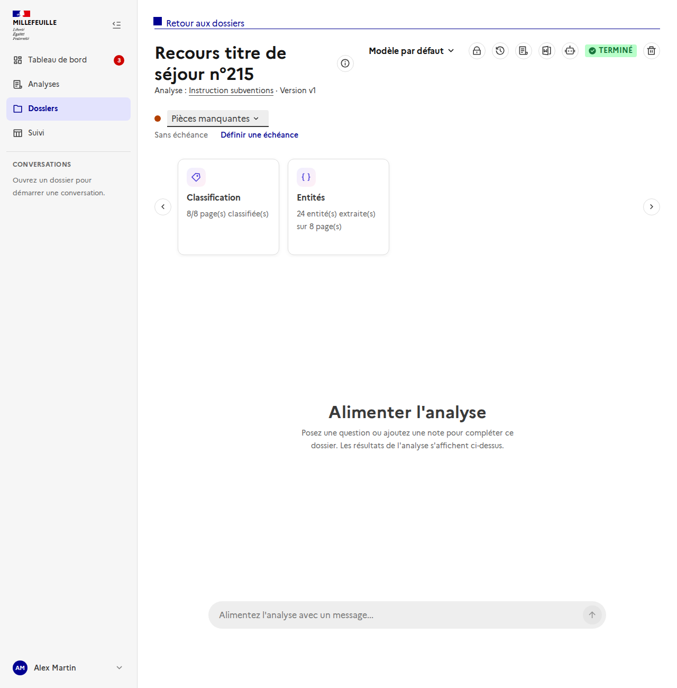
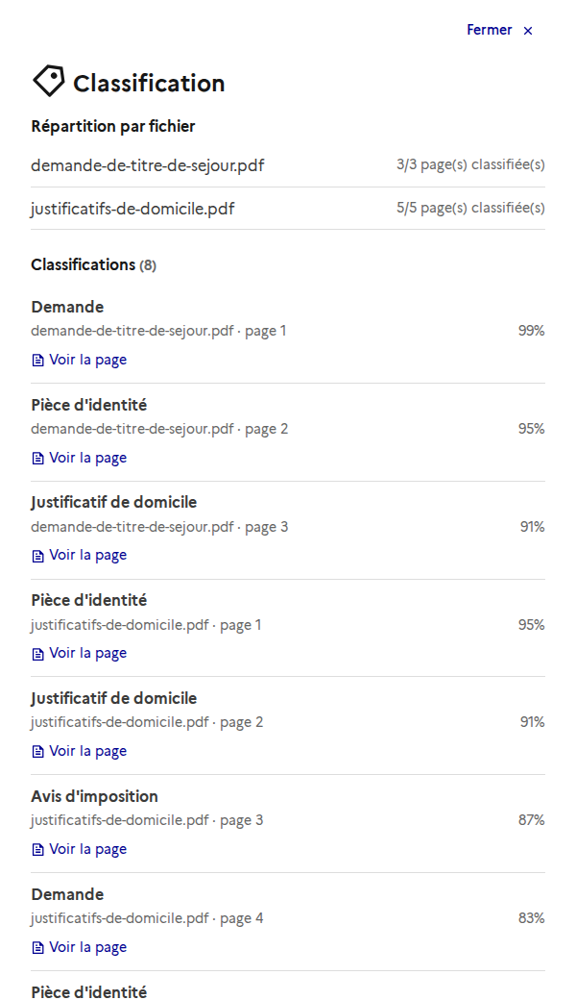
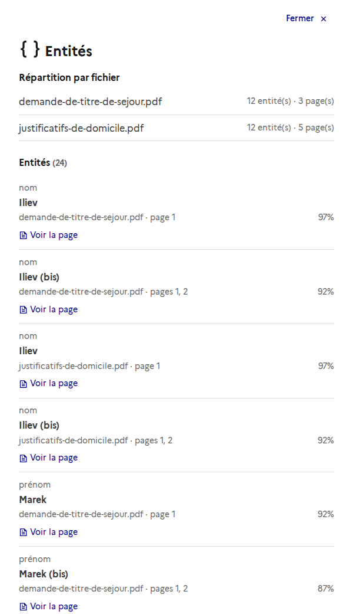
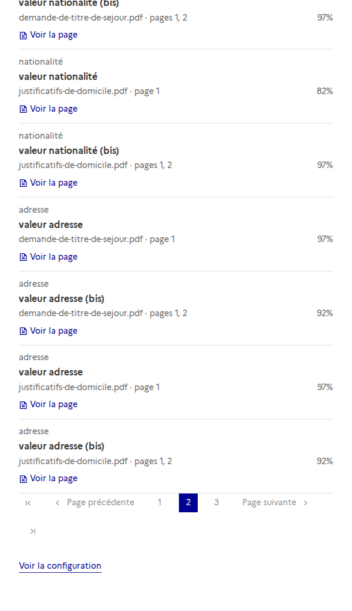
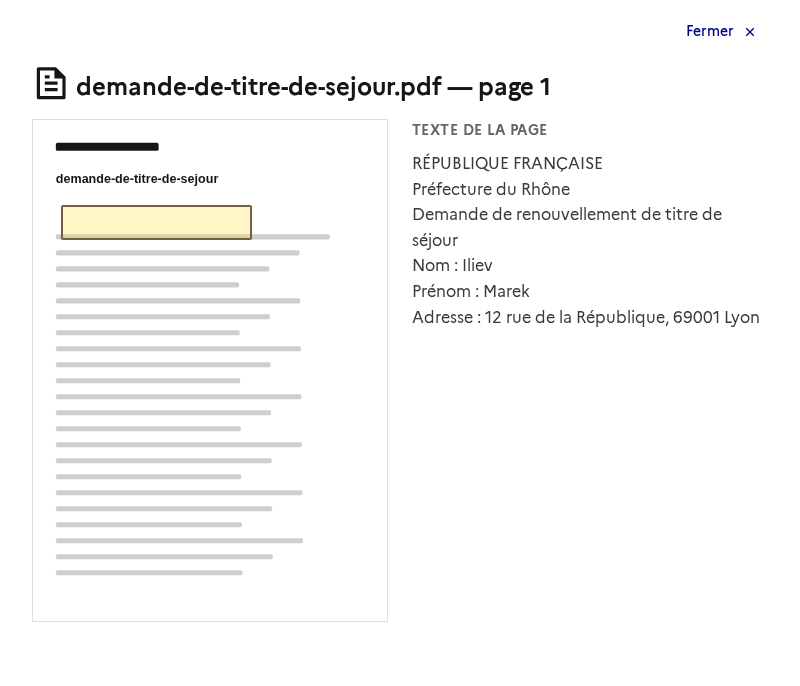
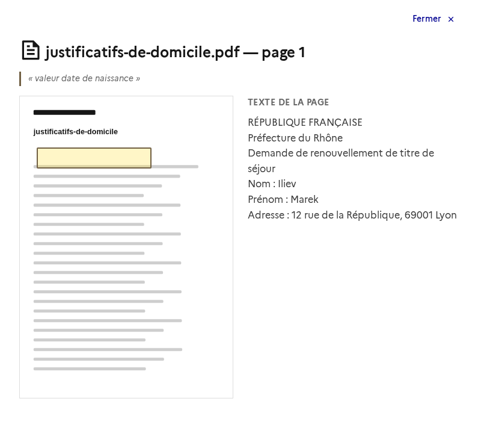

# Détail des résultats d'un dossier : classification et entités

Dans la page d'un dossier, les cartes **Classification** et **Entités** ne donnent qu'un compteur. Un clic ouvre le **détail** : la répartition par fichier, puis la liste paginée des résultats.

## Les cartes



- **Classification** : `8/8 page(s) classifiée(s)` compte les pages classifiées sur le **total des pages de tous les fichiers** du dossier.
- **Entités** : `24 entité(s) extraite(s) sur 8 page(s)`, même périmètre.

## Le détail d'une classification



- **Répartition par fichier** : pour chaque fichier, les pages classifiées sur ses pages totales. Un fichier ignoré ou en échec se repère ici.
- **Liste** : une ligne par page, avec le label, le fichier, le numéro de page et la confiance.

## Le détail des entités



- **Répartition par fichier** : le nombre d'entités et de pages de chaque fichier.
- **Liste** : le nom de l'entité, sa valeur, le fichier, les pages qu'elle couvre (une entité peut s'étendre sur plusieurs pages) et la confiance.

La liste est **paginée par 10** :



## Voir la page source

Chaque ligne, en classification comme en entités, a un lien **Voir la page**. Il ouvre la page du fichier par-dessus la liste : la **capture** avec la **zone** du résultat encadrée, et le **texte de la page**. Pour une entité, la valeur extraite est rappelée en citation. Si l'entité s'étend sur plusieurs pages, on passe de l'une à l'autre. « Fermer » ramène à la liste, sur la même page.

C'est la même fenêtre que celle des sources citées par l'assistant dans le chat.

| Classification | Entité |
| --- | --- |
|  |  |

## API

| Route | Rôle |
| --- | --- |
| `GET /api/dossiers/{id}/results/breakdown` | Répartition par fichier : pages, pages classifiées, entités. |
| `GET /api/dossiers/{id}/results?kind=label\|entity&page=&page_size=` | Classifications ou entités, paginées (`page_size` : 10 par défaut, 100 au plus). |

Chaque ligne de `results` porte le fichier, les `pages` (id et numéro) et les `bounding_boxes` qui permettent d'ouvrir la page source. La capture et le texte d'une page se lisent par `GET /api/dossiers/{id}/documents/{document_id}/pages/{page_id}` et `.../screenshot`, déjà utilisés par le chat.

Les deux routes appliquent le même contrôle d'accès au dossier que les autres : un dossier non visible répond 404.

## Régénérer les captures

Avec le serveur de dev lancé (`pnpm dev`), depuis `frontend/` :

```bash
node scripts/doc-screenshots.mjs http://localhost:5173 results
```

L'API est simulée par le script : ni backend ni Keycloak ne sont nécessaires.
